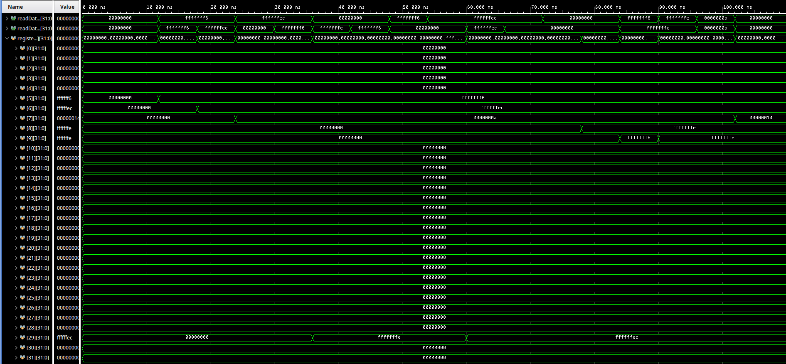
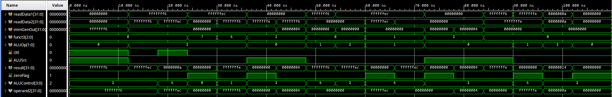
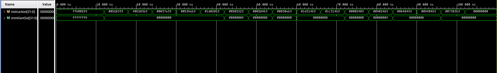
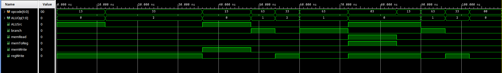
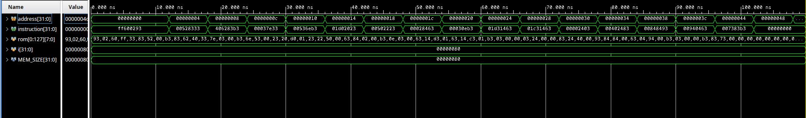
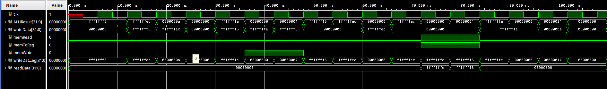
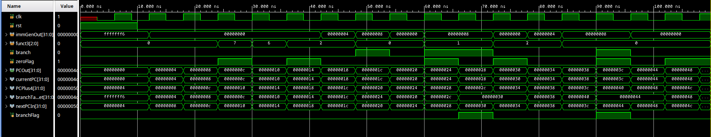
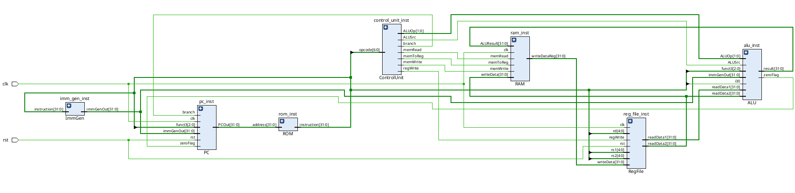

# ECE3700J lab 2 report

## Components Design

### Register File

```verilog
// RegFile.v
module RegFile (
    input clk,
    input rst,

    input [4:0] rs1,
    input [4:0] rs2,
    input [4:0] rd,
    input [31:0] writeData,
    input regWrite,

    output [31:0] readData1,
    output [31:0] readData2
);

  reg [31:0] registerFile[0:31];

endmodule
```

### ALU

This ALU module includes ALU Control and the Mux switching between register file and immediate generator

```verilog
// ALU.v
module ALU (
    input [31:0] readData1,
    input [31:0] readData2,
    input [31:0] immGenOut,
    input [2:0] funct3,
    input [1:0] ALUOp,
    input i30,
    input ALUSrc,

    output [31:0] result,
    output zeroFlag
);

  wire [ 3:0] ALUControl;
  wire [31:0] operand2;

  ALUControlUnit aluControlUnit;

  ALUMux aluMux;

  ALUCore aluCore;

endmodule
```

```verilog
// ALU.v
module ALUCore (
    input [ 3:0] ALUControl,
    input [31:0] operand1,
    input [31:0] operand2,

    output reg [31:0] result,
    output zeroFlag
);

endmodule
```

```verilog
// ALU.v
module ALUControlUnit (
    input i30,
    input [2:0] funct3,
    input [1:0] ALUOp,

    output reg [3:0] ALUControl
);

endmodule
```

```verilog
// ALU.v
module ALUMux (
    input [31:0] readData2,
    input [31:0] immGenOut,
    input ALUSrc,

    output [31:0] operand2
);

endmodule
```

### ROM

i.e., Instruction Memory

```verilog
// ROM.v
module ROM (
    input [31:0] address,

    output reg [31:0] instruction
);

  localparam MEM_SIZE = 128;  // Size in Bytes
  reg [7:0] rom[0:MEM_SIZE-1];

endmodule
```

### RAM

i.e., Data Memory. This RAM includes the Mux after Data Memory switching between writing Memory data or ALU result back to Register File.

```verilog
// RAM.v
module RAM (
    input clk,

    input [31:0] ALUResult,
    input [31:0] writeData,
    input memRead,
    input memToReg,
    input memWrite,

    output [31:0] writeDataReg
);

  wire [31:0] readData;

  RAMCore ramCore;

  RAMMux ramMux;

endmodule
```

```verilog
// RAM.v
module RAMCore (
    input clk,
    input memRead,
    input memWrite,
    input [31:0] address,
    input [31:0] writeData,

    output reg [31:0] readData
);

  localparam MEM_SIZE = 128;  // Size in Bytes
  reg [7:0] ram[0:MEM_SIZE-1];

endmodule
```

```verilog
// RAM.v
module RAMMux (
    input [31:0] readData,
    input [31:0] ALUResult,
    input memToReg,

    output [31:0] writeDataReg
);

endmodule
```

### Immediate Generator

```verilog
// ImmGen.v
module ImmGen (
    input [31:0] instruction,

    output reg [31:0] immGenOut
);

endmodule
```

### Control Unit

```verilog
// ControlUnit.v
module ControlUnit (
    input [6:0] opcode,

    output reg [1:0] ALUOp,
    output reg ALUSrc,
    output reg branch,
    output reg memRead,
    output reg memToReg,
    output reg memWrite,
    output reg regWrite
);

endmodule
```

### PC

This PC module includes all the combinational logic of calculating the next PC, including the PC + 4, PC + immediate generator output, and the Mux for selecting the next PC based on branch conditions.

To implement both `beq` and `bne`, a wire of `funct3` is connected to the PC module to determine to branch when `zeroFlag` is either true or false. The reason why this switch logic is implemented here in PC using `funct3` instead of in ALU is if there are more branch instructions to implement, the change will be minor.

The target address is not left-shifted by 1, as opposed to the slides, for simplicity.

```verilog
// PC.v
module PC (
    input clk,
    input rst,

    input [31:0] immGenOut,
    input [2:0] funct3,
    input branch,
    input zeroFlag,

    output [31:0] PCOut
);

  wire [31:0] currentPC;
  wire [31:0] PCPlus4;
  wire [31:0] branchTarget;
  wire [31:0] nextPCIn;

  reg branchFlag;

  PCCore pcCore;

  // PC + 4
  PCAdd4 pcAdd4;

  // PC + ImmGenOut
  PCBranchAdder pcBranchAdder;

  PCMux pcMux;

endmodule
```

```verilog
// PC.v
module PCCore (
    input clk,
    input rst,
    input [31:0] nextPC,

    output reg [31:0] PC
);

endmodule
```

```verilog
// PC.v
// PC + 4
module PCAdd4 (
    input  [31:0] PCIn,
    output [31:0] nextInstruction
);

endmodule
```

```verilog
// PC.v
// PC + ImmGenOut 
module PCBranchAdder (
    input  [31:0] PCIn,
    input  [31:0] immGenOut,
    output [31:0] branchInstruction
);

endmodule
```

```verilog
// PC.v
module PCMux (
    input  [31:0] nextInstruction,
    input  [31:0] branchInstruction,
    input         branchFlag,
    output [31:0] nextPCOut
);

endmodule
```

## Simulation Result

### Register File



### ALU



### Immediate Generator



### Control Unit



### ROM



### RAM



### PC (including adder and branching)



## Simulation of Instructions

```log
Time resolution is 1 ps
Initialising ROM
Initialising RAM


Reset:

time:                   6
PC:00000000000000000000000000000000
Inst:11111111011000000000001010010011
x5(t0):00000000000000000000000000000000
x6(t1):00000000000000000000000000000000
x7(t2):00000000000000000000000000000000
x28(t3):00000000000000000000000000000000
x29(t4):00000000000000000000000000000000
x8(s0):00000000000000000000000000000000
x9(s1):00000000000000000000000000000000
Mem[0]:00000000000000000000000000000000
Mem[4]:00000000000000000000000000000000


// addi t0 x0 -10

time:                  12
PC:00000000000000000000000000000000
Inst:11111111011000000000001010010011
x5(t0):00000000000000000000000000000000
x6(t1):00000000000000000000000000000000
x7(t2):00000000000000000000000000000000
x28(t3):00000000000000000000000000000000
x29(t4):00000000000000000000000000000000
x8(s0):00000000000000000000000000000000
x9(s1):00000000000000000000000000000000
Mem[0]:00000000000000000000000000000000
Mem[4]:00000000000000000000000000000000


// add t1 t0 t0

time:                  18
PC:00000000000000000000000000000100
Inst:00000000010100101000001100110011
x5(t0):11111111111111111111111111110110
x6(t1):00000000000000000000000000000000
x7(t2):00000000000000000000000000000000
x28(t3):00000000000000000000000000000000
x29(t4):00000000000000000000000000000000
x8(s0):00000000000000000000000000000000
x9(s1):00000000000000000000000000000000
Mem[0]:00000000000000000000000000000000
Mem[4]:00000000000000000000000000000000


// sub t2 t0 t1

time:                  24
PC:00000000000000000000000000001000
Inst:01000000011000101000001110110011
x5(t0):11111111111111111111111111110110
x6(t1):11111111111111111111111111101100
x7(t2):00000000000000000000000000000000
x28(t3):00000000000000000000000000000000
x29(t4):00000000000000000000000000000000
x8(s0):00000000000000000000000000000000
x9(s1):00000000000000000000000000000000
Mem[0]:00000000000000000000000000000000
Mem[4]:00000000000000000000000000000000


// and t3 t1 x0

time:                  30
PC:00000000000000000000000000001100
Inst:00000000000000110111111000110011
x5(t0):11111111111111111111111111110110
x6(t1):11111111111111111111111111101100
x7(t2):00000000000000000000000000001010
x28(t3):00000000000000000000000000000000
x29(t4):00000000000000000000000000000000
x8(s0):00000000000000000000000000000000
x9(s1):00000000000000000000000000000000
Mem[0]:00000000000000000000000000000000
Mem[4]:00000000000000000000000000000000


// or t4 t1 t0

time:                  36
PC:00000000000000000000000000010000
Inst:00000000010100110110111010110011
x5(t0):11111111111111111111111111110110
x6(t1):11111111111111111111111111101100
x7(t2):00000000000000000000000000001010
x28(t3):00000000000000000000000000000000
x29(t4):00000000000000000000000000000000
x8(s0):00000000000000000000000000000000
x9(s1):00000000000000000000000000000000
Mem[0]:00000000000000000000000000000000
Mem[4]:00000000000000000000000000000000


// sw t4 0(x0)

time:                  42
PC:00000000000000000000000000010100
Inst:00000001110100000010000000100011
x5(t0):11111111111111111111111111110110
x6(t1):11111111111111111111111111101100
x7(t2):00000000000000000000000000001010
x28(t3):00000000000000000000000000000000
x29(t4):11111111111111111111111111111110
x8(s0):00000000000000000000000000000000
x9(s1):00000000000000000000000000000000
Mem[0]:00000000000000000000000000000000
Mem[4]:00000000000000000000000000000000


// sw t0 4(x0)

time:                  48
PC:00000000000000000000000000011000
Inst:00000000010100000010001000100011
x5(t0):11111111111111111111111111110110
x6(t1):11111111111111111111111111101100
x7(t2):00000000000000000000000000001010
x28(t3):00000000000000000000000000000000
x29(t4):11111111111111111111111111111110
x8(s0):00000000000000000000000000000000
x9(s1):00000000000000000000000000000000
Mem[0]:11111111111111111111111111111110
Mem[4]:00000000000000000000000000000000


// beq t0 x0 L1

time:                  54
PC:00000000000000000000000000011100
Inst:00000000000000101000010001100011
x5(t0):11111111111111111111111111110110
x6(t1):11111111111111111111111111101100
x7(t2):00000000000000000000000000001010
x28(t3):00000000000000000000000000000000
x29(t4):11111111111111111111111111111110
x8(s0):00000000000000000000000000000000
x9(s1):00000000000000000000000000000000
Mem[0]:11111111111111111111111111111110
Mem[4]:11111111111111111111111111110110


// add t4 t1 x0

time:                  60
PC:00000000000000000000000000100000
Inst:00000000000000110000111010110011
x5(t0):11111111111111111111111111110110
x6(t1):11111111111111111111111111101100
x7(t2):00000000000000000000000000001010
x28(t3):00000000000000000000000000000000
x29(t4):11111111111111111111111111111110
x8(s0):00000000000000000000000000000000
x9(s1):00000000000000000000000000000000
Mem[0]:11111111111111111111111111111110
Mem[4]:11111111111111111111111111110110


// bne t1 t4 error1

time:                  66
PC:00000000000000000000000000100100
Inst:00000001110100110001010001100011
x5(t0):11111111111111111111111111110110
x6(t1):11111111111111111111111111101100
x7(t2):00000000000000000000000000001010
x28(t3):00000000000000000000000000000000
x29(t4):11111111111111111111111111101100
x8(s0):00000000000000000000000000000000
x9(s1):00000000000000000000000000000000
Mem[0]:11111111111111111111111111111110
Mem[4]:11111111111111111111111111110110


// bne t1 t3 L2

time:                  72
PC:00000000000000000000000000101000
Inst:00000001110000110001010001100011
x5(t0):11111111111111111111111111110110
x6(t1):11111111111111111111111111101100
x7(t2):00000000000000000000000000001010
x28(t3):00000000000000000000000000000000
x29(t4):11111111111111111111111111101100
x8(s0):00000000000000000000000000000000
x9(s1):00000000000000000000000000000000
Mem[0]:11111111111111111111111111111110
Mem[4]:11111111111111111111111111110110


// lw s0 0(x0)

time:                  78
PC:00000000000000000000000000110000
Inst:00000000000000000010010000000011
x5(t0):11111111111111111111111111110110
x6(t1):11111111111111111111111111101100
x7(t2):00000000000000000000000000001010
x28(t3):00000000000000000000000000000000
x29(t4):11111111111111111111111111101100
x8(s0):00000000000000000000000000000000
x9(s1):00000000000000000000000000000000
Mem[0]:11111111111111111111111111111110
Mem[4]:11111111111111111111111111110110


// lw s1 4(x0)

time:                  84
PC:00000000000000000000000000110100
Inst:00000000010000000010010010000011
x5(t0):11111111111111111111111111110110
x6(t1):11111111111111111111111111101100
x7(t2):00000000000000000000000000001010
x28(t3):00000000000000000000000000000000
x29(t4):11111111111111111111111111101100
x8(s0):11111111111111111111111111111110
x9(s1):00000000000000000000000000000000
Mem[0]:11111111111111111111111111111110
Mem[4]:11111111111111111111111111110110


// addi s1 s1 8

time:                  90
PC:00000000000000000000000000111000
Inst:00000000100001001000010010010011
x5(t0):11111111111111111111111111110110
x6(t1):11111111111111111111111111101100
x7(t2):00000000000000000000000000001010
x28(t3):00000000000000000000000000000000
x29(t4):11111111111111111111111111101100
x8(s0):11111111111111111111111111111110
x9(s1):11111111111111111111111111110110
Mem[0]:11111111111111111111111111111110
Mem[4]:11111111111111111111111111110110


// beq s0 s1 L3

time:                  96
PC:00000000000000000000000000111100
Inst:00000000100101000000010001100011
x5(t0):11111111111111111111111111110110
x6(t1):11111111111111111111111111101100
x7(t2):00000000000000000000000000001010
x28(t3):00000000000000000000000000000000
x29(t4):11111111111111111111111111101100
x8(s0):11111111111111111111111111111110
x9(s1):11111111111111111111111111111110
Mem[0]:11111111111111111111111111111110
Mem[4]:11111111111111111111111111110110


// add t2 t2 t2

time:                 102
PC:00000000000000000000000001000100
Inst:00000000011100111000001110110011
x5(t0):11111111111111111111111111110110
x6(t1):11111111111111111111111111101100
x7(t2):00000000000000000000000000001010
x28(t3):00000000000000000000000000000000
x29(t4):11111111111111111111111111101100
x8(s0):11111111111111111111111111111110
x9(s1):11111111111111111111111111111110
Mem[0]:11111111111111111111111111111110
Mem[4]:11111111111111111111111111110110


// stop

time:                 108
PC:00000000000000000000000001001000
Inst:00000000000000000000000000000000
x5(t0):11111111111111111111111111110110
x6(t1):11111111111111111111111111101100
x7(t2):00000000000000000000000000010100
x28(t3):00000000000000000000000000000000
x29(t4):11111111111111111111111111101100

```

All are correct. (**Because I added a reset at beginning, the timing is 6ps later than without.**)

## RTL schematic


